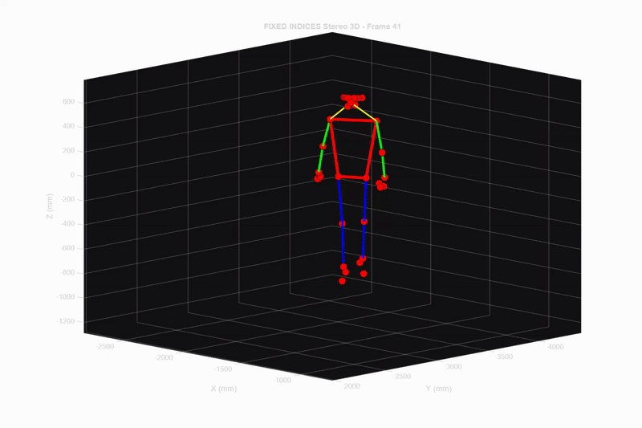

# MotionMetrics - 3D Sports Biomechanics Analysis System

 

*Democratizing precision motion capture for sports biomechanics analysis*

---

## 🚀 Project Overview

**MotionMetrics** is a comprehensive 3D sports biomechanics analysis system that bridges the gap between expensive professional motion capture systems (>$100,000) and low-accuracy alternatives. Our innovative solution combines synchronized stereo cameras with advanced computer vision techniques to deliver accurate, accessible, and cost-effective motion analysis.

### 🎯 Why MotionMetrics?

- **Accessibility**: Affordable alternative to high-end systems like Vicon and Qualisys
- **Precision**: Sub-centimeter accuracy with 0.07 pixel stereo calibration error
- **Versatility**: Hybrid marker-based and markerless detection approaches
- **User-Friendly**: Automated analysis and professional report generation
- **Clinical Ready**: Validated through comparative analysis of normal vs. abnormal gait patterns

---

## ✨ Key Features

### 🎥 **Dual-Mode Motion Capture**
- **Markerless Detection**: MediaPipe integration for 33 anatomical landmarks
- **Marker-Based Tracking**: Green spherical markers on 14 major body joints
- **Smart Fallback**: MediaPipe prediction during marker occlusion

### 🔬 **Precision 3D Reconstruction**
- High-accuracy stereo camera calibration (0.07 pixels reprojection error)
- Advanced lens distortion correction
- Direct Linear Transformation (DLT) triangulation algorithms
- 70-85% triangulation success rates with sub-centimeter precision

### 📊 **Comprehensive Biomechanical Analysis**
- Automated joint angle calculations using vector dot product analysis
- Velocity and acceleration profiling
- Bilateral symmetry assessment
- Real-time movement visualization

### 📋 **Professional Reporting**
- Automated PDF report generation
- 3D skeleton visualizations
- Joint angle progression charts
- Movement statistics and clinical insights
- Bilateral comparison tables

---

## 🛠️ Technologies Used

| **Language/Framework** | **Purpose** |
|:----------------------:|:------------|
|  | Core detection algorithms, GUI application |
|  | Computer vision processing |
|  | Markerless pose estimation |
|  | Stereo calibration, 3D reconstruction |
|  | Interactive analysis application |
|  | Synchronized video capture |

---

## 👥 Contributors

|:---------------:|
| **Dilranga Dissanayake** | 
| **Thithira Paranawithana** | 
| **Nipini Tennakoon** |

---

## 🏆 Achievements

- ✅ Achieved 0.07 pixel mean reprojection error in stereo calibration
- ✅ Successfully validated through normal vs. abnormal gait analysis
- ✅ Developed comprehensive clinical reporting system
- ✅ Created user-friendly analysis interface for non-technical users

---

## 📈 Validation Results

Our system successfully detected movement asymmetries in comparative analysis:
- **Normal gait**: Bilateral knee standard deviation (13.1° vs 13.6°)
- **Injured gait**: Clear asymmetry detected (12.4° vs 8.5°)
- **Clinical significance**: Objective evidence of compensatory movement patterns

---

## 🙏 Acknowledgments

Special thanks to:
- Our project supervisors and advisors
- The open-source community
- MediaPipe and OpenCV development teams
- MATLAB Computer Vision Toolbox developers

---

*Made with ❤️ by MotionMetrics Team for the sports biomechanics community*

